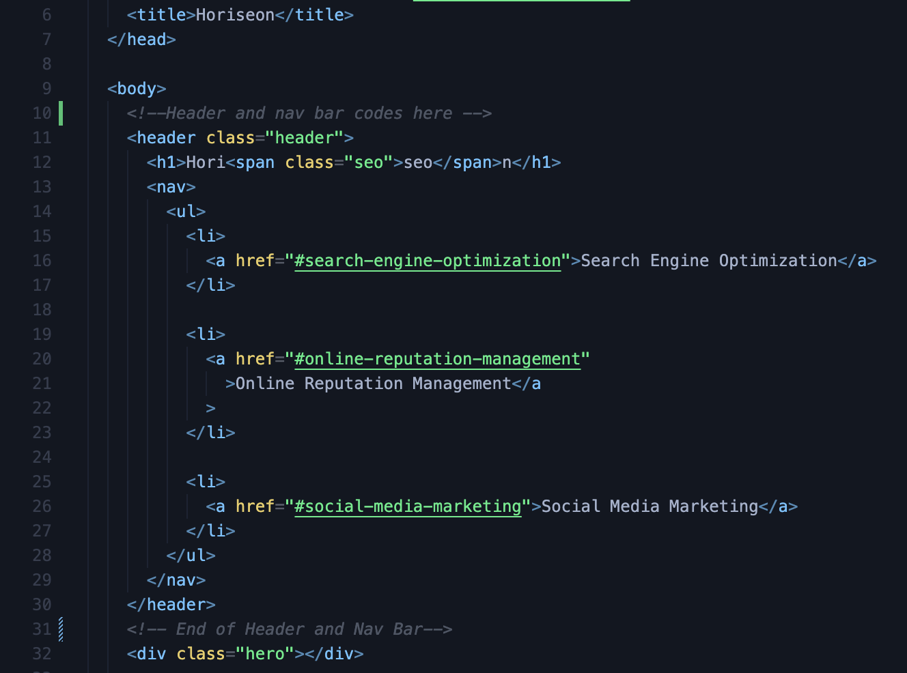
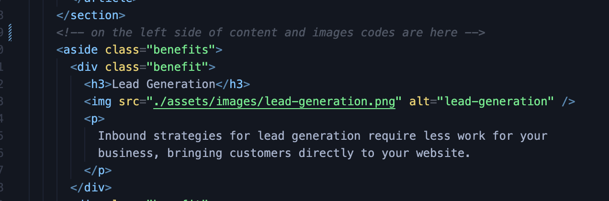
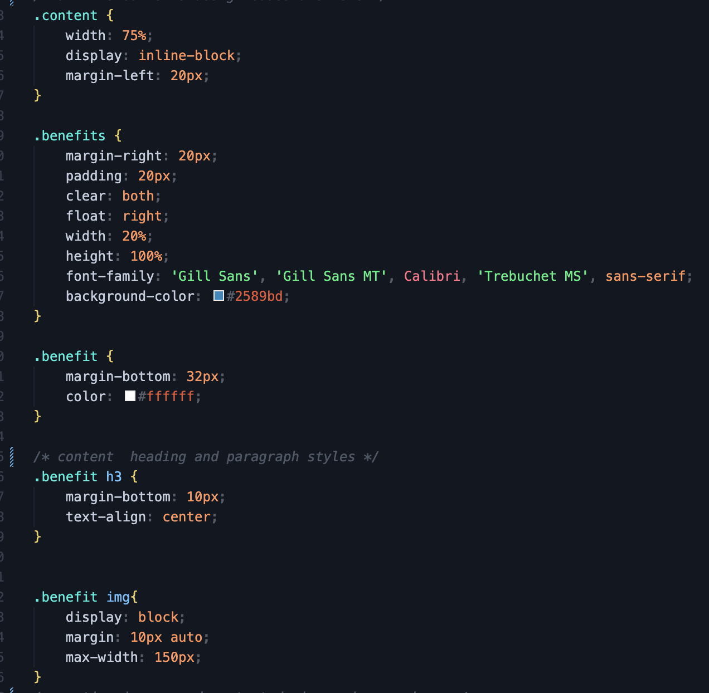
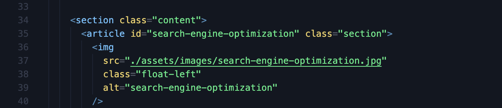

# ASSIGNMENT - 1

## What Was My Motivation?
My motivation is to improve myself and develop my first web page for assignment.

## What Was The Problem With Web Page?
* Structure of the HTML elements was missing
*  CSS styling was not properly implemented
* The website lacked interactivity, such as hover effects or buttons that respond when clicked on.


## How Did I Solve The Problems?
* I added proper structure to the HTML code by using semantic tags like `<header>`, `aside` ,` nav `, `<main>` and `<footer>`. This improved the readability.
* 
* To address the issue of missing structure in the HTML
* I added attributes such as ``` alt ``` for images, ```class``` and ```id ``` for specific identification of HTML elements.
* 
* For improving CSS styling, I used ``` benefit ```  class to group similar properties together under a single selector.
* 
* I added ```section``` for paragraphs and images. This helped organize the content better.
* 

## What Did I Learned?
* I learned how to use semantic tags effectively which improves
* I also practiced using CSS selectors to target specific
* I learned semantic elements for website.
* I learned how to use ```alt``` , ```id``` and  ```class``` attributes correctly.

## Links

* [Github  Repository](https://github.com/veyselarslan12/assignment-1/settings/pages)

* [Deployment Link](https://veyselarslan12.github.io/assignment-1/)

